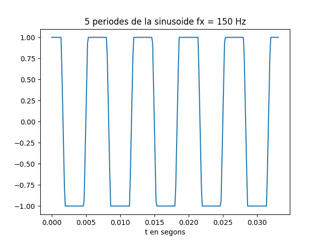
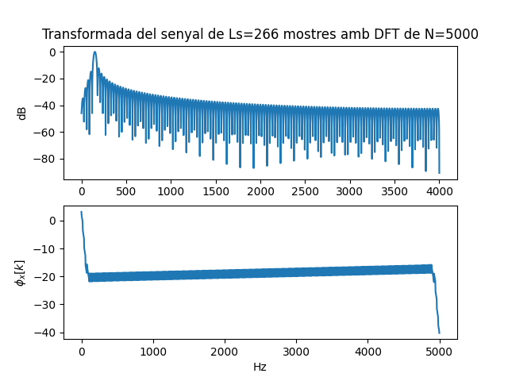
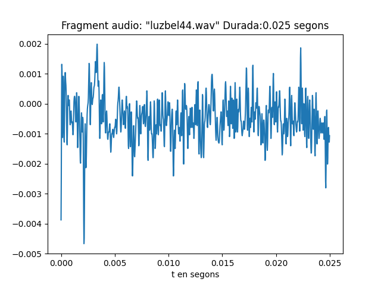
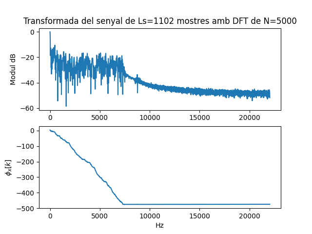

# Primera tasca APA 2023: Anàlisi fitxer de so

## Nom i cognoms:

## Representació temporal i freqüencial de senyals d'àudio

### Domini temporal

Per llegir, escriure i representar un fitxer en format `*.wav` en python podem fem servir els següents mòduls:

- Numpy:

    ```python
    import numpy as np
    ```

- Matplotlib:

    ```python
    import matplotlib.pyplot as plt
    ```

- Soundfile:

    ```python
    import soundfile as sf
    ```

Per **crear** i **guardar** a un fitxer un senyal sinusoidal de freqüència `fx Hz`, digitalitzat a `fm Hz`, de durada `T` segons i amplitud
`A` fem:

```python
T= 2.5                               # Durada de T segons
fm=8000                              # Freqüència de mostratge en Hz
fx=440                               # Freqüència de la sinusoide
A=4                                  # Amplitud de la sinusoide
pi=np.pi                             # Valor del número pi
L = int(fm * T)                      # Nombre de mostres del senyal digital
Tm=1/fm                              # Període de mostratge
t=Tm*np.arange(L)                    # Vector amb els valors de la variable temporal, de 0 a T
x = A * np.cos(2 * pi * fx * t)      # Senyal sinusoidal
sf.write('so_exemple1.wav', x, fm)   # Escriptura del senyal a un fitxer en format wav
```

El resultat és un fitxer guardat al directori de treball i que es pot reproduir amb qualsevol reproductor d'àudio

Per **representar** gràficament 5 períodes de senyal fem:

```python
Tx=1/fx                                   # Període del senyal
Ls=int(fm*5*Tx)                           # Nombre de mostres corresponents a 5 períodes de la sinusoide
plt.figure(0)                             # Nova figura
plt.plot(t[0:Ls], x[0:Ls])                # Representació del senyal en funció del temps
plt.xlabel('t en segons')                 # Etiqueta eix temporal
plt.title('5 periodes de la sinusoide')   # Títol del gràfic
plt.show()                                # Visualització de l'objecte gràfic. 
```

El resultat del gràfic és:


> Nota: Si es treballa amb ipython, es pot escriure %matplotlib i no cal posar el plt.show() per veure gràfics
El senyal es pot **escoltar (reproduir)** directament des de python important un entorn de treball amb els dispositius de so, com per
exemple `sounddevice`:

```python
import sounddevice as sd      # Importem el mòdul sounddevice per accedir a la tarja de so
sd.play(x, fm)                # Reproducció d'àudio
```

### Domini transformat

Domini transformat. Els senyals es poden analitzar en freqüència fent servir la Transformada Discreta de Fourier.

La funció que incorpora el paquet `numpy` al submòdul `fft` és `fft`:

```python
from numpy.fft import fft     # Importem la funció fft
N=5000                        # Dimensió de la transformada discreta
X=fft(x[0 : Ls], N)           # Càlcul de la transformada de 5 períodes de la sinusoide
```

I podem representar el mòdul i la fase, en funció de la posició de cada valor amb:

```python
k=np.arange(N)                        # Vector amb els valors 0≤  k<N
plt.figure(1)                         # Nova figura
plt.subplot(211)                      # Espai per representar el mòdul
plt.plot(k,abs(X))                    # Representació del mòdul de la transformada
plt.title(f'Transformada del senyal de Ls={Ls} mostres amb DFT de N={N}')   # Etiqueta del títol
plt.ylabel('|X[k]|')                  # Etiqueta de mòdul
plt.subplot(212)                      # Espai per representar la fase
plt.plot(k,np.unwrap(np.angle(X)))    # Representació de la fase de la transformad, desenroscada
plt.xlabel('Index k')                 # Etiqueta de l'eix d'abscisses 
plt.ylabel('$\phi_x[k]$')             # Etiqueta de la fase en Latex
plt.show()                            # Per mostrar els grafics
```


Proves i exercicis a fer i entregar
-----------------------------------

### 1. Reprodueix l'exemple fent servir diferents freqüències per la sinusoide. Al menys considera $f_x = 4$ kHz, a banda d'una freqüència pròpia en el marge audible. Comenta els resultats.
```python
T= 2.5                               # Durada de T segons
fm=8000                              # Freqüència de mostratge en Hz
A=4                                  # Amplitud de la sinusoide
PI=np.pi                             # Valor del número pi
L = int(fm*T)                        # Nombre de mostres del senyal digital
Tm=1/fm                              # Període de mostratge
t=Tm*np.arange(L)                    # Vector amb els valors de la variable temporal, de 0 a T

# Freqüència 150 Hz 
fx=150                               # Freqüència de la sinusoide 
x = A * np.cos(2 * PI * fx * t)      # Senyal sinusoidal
sf.write('so_exemple1.wav', x, fm)   # Escriptura del senyal a un fitxer en format wav

Tx=1/fx                              # Període del senyal
Ls=int(fm*5*Tx)                      # Nombre de mostres corresponents a 5 períodes de la sinusoide

plt.figure(0)                                        # Nova figura
plt.plot(t[0:Ls], x[0:Ls])                           # Representació del senyal en funció del temps
plt.xlabel('t en segons')                            # Etiqueta eix temporal
plt.title('5 periodes de la sinusoide fx = 150Hz')   # Títol del gràfic
plt.show() 
sd.play(x,fm)            # Reproducció d'àudio

N=5000                   # Dimensió de la transformada discreta
X=fft(x[0:Ls],N)         # Càlcul de la transformada de 5 períodes de la sinusoide
k=np.arange(N)           # Vector amb els valors 0≤  k<N

plt.figure(1)                         # Nova figura
plt.subplot(211)                      # Espai per representar el mòdul
plt.plot(k,abs(X))                    # Representació del mòdul de la transformada
plt.title(f'Transformada del senyal de Ls={Ls} mostres amb DFT de N={N}')   # Etiqueta del títol
plt.ylabel('|X[k]|')                  # Etiqueta de mòdul
plt.subplot(212)                      # Espai per representar la fase
plt.plot(k,np.unwrap(np.angle(X)))    # Representació de la fase de la transformad, desenroscada
plt.xlabel('Index k')                 # Etiqueta de l'eix d'abscisses 
plt.ylabel('$\phi_x[k]$')             # Etiqueta de la fase en Latex
plt.show()                            # Per mostrar els grafics

# Freqüència 4kHz
fx=4000                              # Freqüència de la sinusoide
x = A * np.cos(2 * PI * fx * t)     # Senyal sinusoidal
sf.write('so_exemple2.wav', x, fm)   # Escriptura del senyal a un fitxer en format wav

Tx1=1/fx                             # Període del senyal
Ls=int(fm*5*Tx)                     # Nombre de mostres corresponents a 5 períodes de la sinusoide

plt.figure(0)                                      # Nova figura
plt.plot(t[0:Ls], x[0:Ls])                      # Representació del senyal en funció del temps
plt.xlabel('t en segons')                          # Etiqueta eix temporal
plt.title('5 periodes de la sinusoide fx = 4kHz')  # Títol del gràfic
plt.show()                                         # Per mostrar els grafics
sd.play(x,fm)                                     # Reproducció d'àudio

N=5000                        # Dimensió de la transformada discreta
X1=fft(x[0:Ls], N)          # Càlcul de la transformada de 5 períodes de la sinusoide
k=np.arange(N)                # Vector amb els valors 0≤  k<N

plt.figure(1)                         # Nova figura
plt.subplot(211)                      # Espai per representar el mòdul
plt.plot(k,abs(X))                   # Representació del mòdul de la transformada
plt.title(f'Transformada del senyal de Ls={Ls} mostres amb DFT de N={N}')   # Etiqueta del títol
plt.ylabel('|X[k]|')                  # Etiqueta de mòdul
plt.subplot(212)                      # Espai per representar la fase
plt.plot(k,np.unwrap(np.angle(X)))   # Representació de la fase de la transformad, desenroscada
plt.xlabel('Index k')                 # Etiqueta de l'eix d'abscisses 
plt.ylabel('$\phi_x[k]$')             # Etiqueta de la fase en Latex
plt.show()                            # Per mostrar els gràfics

# Freqüència 6,5kHz
fx=6500                              # Freqüència de la sinusoide 
x = A * np.cos(2 * PI * fx * t)     # Senyal sinusoidal
sf.write('so_exemple3.wav', x, fm)   # Escriptura del senyal a un fitxer en format wav

Tx=1/fx                             # Període del senyal
Ls=int(fm*5*Tx)                     # Nombre de mostres corresponents a 5 períodes de la sinusoide

plt.figure(0)                                         # Nova figura
plt.plot(t[0:Ls], x[0:Ls])                         # Representació del senyal en funció del temps
plt.xlabel('t en segons')                             # Etiqueta eix temporal
plt.title('5 periodes de la sinusoide fx = 6,5kHz')   # Títol del gràfic
plt.show()                                            # Per mostrar els grafics
sd.play(x,fm)                                       # Reproducció d'àudio

N=5000                         # Dimensió de la transformada discreta
X=fft(x[0:Ls],N)            # Càlcul de la transformada de 5 períodes de la sinusoide
k=np.arange(N)                 # Vector amb els valors 0≤  k<N

plt.figure(1)                         # Nova figura
plt.subplot(211)                      # Espai per representar el mòdul
plt.plot(k,abs(X))                   # Representació del mòdul de la transformada
plt.title(f'Transformada del senyal de Ls={Ls} mostres amb DFT de N={N}')   # Etiqueta del títol
plt.ylabel('|X[k]|')                  # Etiqueta de mòdul
plt.subplot(212)                      # Espai per representar la fase
plt.plot(k,np.unwrap(np.angle(X)))   # Representació de la fase de la transformad, desenroscada
plt.xlabel('Index k')                 # Etiqueta de l'eix d'abscisses 
plt.ylabel('$\phi_x[k]$')             # Etiqueta de la fase en Latex
plt.show()                            # Per mostrar els grafics
```
   + Podem escoltar que a les freqüències inferiors a 4kHz, en el nostre cas ```fx = 150Hz``` podem escoltar que el so es més greu i en el cas ```fx2 = 6500Hz``` més agut. 
  
### 2. Modifica el programa per considerar com a senyal a analitzar el senyal del fitxer wav que has creat 
```python
# Freqüència 1 fx = 150 Hz 
x_r,fm = sf.read('so_exemple1.wav')     # Escriptura del senyal a un fitxer en format wav
Tm = 1/fm                                 # Període de mostratge
t = Tm*np.arange(len(x_r))                       # Vector amb els valors de la variable temporal, de 0 a T
sf.write('Nou_so_exemple1.wav',x_r,fm)
fx = 150                                  # Freqüèencia del senyal
Tx=1/fx                                   # Període del senyal
Ls=int(fm*5*Tx)                         # Nombre de mostres corresponents a 5 períodes de la sinusoide

plt.figure(0)                             # Nova figura
plt.plot(t[0:Ls], x_r[0:Ls])            # Representació del senyal en funció del temps
plt.xlabel('t en segons')                 # Etiqueta eix temporal
plt.title('5 periodes de la sinusoide fx = 150 Hz')  # Títol del gràfic
plt.show()                                # Visualització de l'objecte gràfic. 
sd.play(x_r,fm)                           # Reproducció d'àudio

N=5000                                # Dimensió de la transformada discreta
X=fft(x_r[0:Ls],N)                # Càlcul de la transformada de 5 períodes de la sinusoide
k=np.arange(N)                        # Vector amb els valors 0≤  k<N
plt.figure(1)                         # Nova figura
plt.subplot(211)                      # Espai per representar el mòdul
plt.plot(k,abs(X))                  # Representació del mòdul de la transformada
plt.title(f'Transformada del senyal de Ls={Ls} mostres amb DFT de N={N}')   # Etiqueta del títol
plt.ylabel('|X[k]|')                  # Etiqueta de mòdul
plt.subplot(212)                      # Espai per representar la fase
plt.plot(k,np.unwrap(np.angle(X)))  # Representació de la fase de la transformad, desenroscada
plt.xlabel('Index k')                 # Etiqueta de l'eix d'abscisses 
plt.ylabel('$\phi_x[k]$')             # Etiqueta de la fase en Latex
plt.show()                            # Per mostrar els gràfics 
```
- En el cas ```fx = 150Hz``` 
  
  
- La Transformda de Fourier (```dB```) 
  
  

- Explica el resultat del apartat anterior.
    - Podem veure en la darrera gràfica que quan tenim una freqüència més baixa tenim un periode més curt i l'espectre de la TF les freqüències més concentrades.
### 3. Modifica el programa per representar el mòdul de la Transformada de Fourier en dB i l'eix d'abscisses en el marge de $0$ a $f_m/2$ en Hz.

- Comprova que la mesura de freqüència es correspon amb la freqüència de la sinusoide que has fet servir.
```python
T= 2.5                               
fm=8000                             
fx=150                               
A=4                                  
pi=np.pi                           
L =int(fm*T)                     
Tm=1/fm                              
t=Tm*np.arange(L)                   
x = A * np.cos(2 * pi * fx * t)     
sf.write('Nou_so_exemple1.wav',x,fm)  
Tx=1/fx                                   
Ls=int(fm*Tx*5) 


plt.figure(0)                             # Nova figura
plt.plot(t[0:Ls],x[0:Ls])                 # Representació del senyal en funció del temps
plt.xlabel('t en segons')                 # Etiqueta eix temporal
plt.title('5 periodes de la sinusoide fx = 150Hz')  # Títol del gràfic
plt.show()                                # Visualització de l'objecte gràfic. 
sd.play(x,fm)                             # Reproducció d'àudio

N=5000                         # Dimensió de la transformada discreta
X=fft(x[0:Ls],N)               # Càlcul de la transformada de 5 períodes de la sinusoide
k=np.arange(N)                 # Vector amb els valors 0≤k<N

fk = k[0:N//2+1]*fm/N
XdB = 20*np.log10(np.abs(X)/max(np.abs(X[0:N//2+1])))
plt.figure(1)                         # Nova figura
plt.subplot(211)                      # Espai per representar el mòdul
plt.plot(fk,XdB[0:N//2+1])            # Representació del mòdul de la transformada
plt.title(f'Transformada del senyal de Ls={Ls} mostres amb DFT de N={N}')   # Etiqueta del títol
plt.ylabel('dB')                      # Etiqueta de mòdul
plt.subplot(212)                      # Espai per representar la fase
plt.plot(fk,np.unwrap(np.angle(X[0:N//2+1])))    # Representació de la fase de la transformad, desenroscada
plt.xlabel('Hz')                      # Etiqueta de l'eix d'abscisses 
plt.ylabel('$\phi_x[k]$')             # Etiqueta de la fase en Latex
plt.show()                            # Per mostrar els grafics
```

- Com pots identificar l'amplitud de la sinusoide a partir de la representació de la transformada? Comprova-ho amb el senyal generat.

- La Transformda de Fourier (```dB```) 
  
    

  - Es pot deduir si tenim menys mostres del senyal ```Ls``` tindrem una TF amb una amplitud petita ja que la freqüència del senyal es petita.


### 4. Tria un fitxer d'àudio en format wav i mono (el pots aconseguir si en tens amb altres formats amb el programa Audacity). 
- Llegeix el fitxer d'àudio i comprova:
```python
  obj = readwave.open('luzbel44.wav','r')                   # Obrim el fitxer
  print( "Nombre de canals:",obj.getnchannels())            # Nombre de canals
  if(obj.getnchannels()==1): {print("Mono")}               
  else: {print("Stereo")}
  print ( "Freqüència de mostratge:",obj.getframerate())    # Freqüència de mostratge.
  print ("Nombre de mostres de senyal: ",obj.getnframes())  # Nombre de mostres de senyal.
  obj.close()                                               # Sortim del fitxer
  ```
- Tria un segment de senyal de 25ms i insereix una gráfica amb la seva evolució temporal.   
```python
T= 25e-3                            # Durada de T segons
x,fm = sf.read('luzbel44.wav')      # Lectura del fitxer
L = int(fm*T)                       # Nombre de mostres del senyal digital
Tm=1/fm                             # Període de mostratge
t=Tm*np.arange(L)                   # Vector amb els valors de la variable temporal, de 0 a T
sf.write('fluzbel44.wav',x, fm)

plt.figure(0)                                                    # Nova figura
plt.plot(t[0:L],x[0:L])                                          # Representació del senyal en funció del temps
plt.xlabel('t en segons')                                        # Etiqueta eix temporal
plt.title(f'Fragment audio: "luzbel44.wav" Durada:{T} segons')   # Títol del gràfic
plt.show()                                                       # Mostrar el grafic
```
- En el cas ```Audio luzbel44.wav``` 
  
  
  
- Representa la seva transformada en dB en funció de la freqüència, en el marge $f_m\le f\le f_m/2$.
```python
N=5000                                      # Dimensió de la transformada discreta
X=fft(x[0:L],N)                          # Càlcul de la transformada de 5 períodes de la sinusoide
k=np.arange(N)                              # Vector amb els valors 0≤k<N
fk = k[0:N//2+1]*fm/N
XdB = 20*np.log10(np.abs(X)/max(np.abs(X[0:N//2+1])))
plt.figure(1)                               # Nova figura
plt.subplot(211)                            # Espai per representar els dB
plt.plot(fk,XdB[0:N//2+1])                # Representació dels dB en funció de les mostres 
plt.title(f'Transformada del senyal de Ls={L} mostres amb DFT de N={N}')   # Etiqueta del títol
plt.ylabel('Modul dB')                      # Etiqueta de mòdul
plt.subplot(212)                            # Espai per representar la fase
plt.plot(fk,np.unwrap(np.angle(X[0:N//2+1])))       # Representació de la fase de la transformad, desenroscada
plt.xlabel('Hz')                            # Etiqueta de l'eix d'abscisses 
plt.ylabel('$\phi_x[k]$')                   # Etiqueta de l'eix de coordenades
plt.show()                                  # Per mostrar els gràfics
```
- La Transformda de Fourier (```dB```) 
  
  
  

    - El rang determinat anteriorment no es posible de representar.
- Quines son les freqüències més importants del segment triat?   
  - Les freqüències més importants estan entre 1Hz i 7,5kHz
