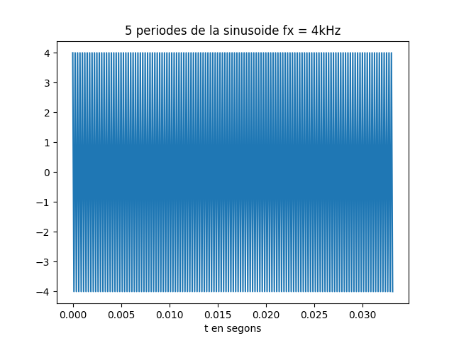
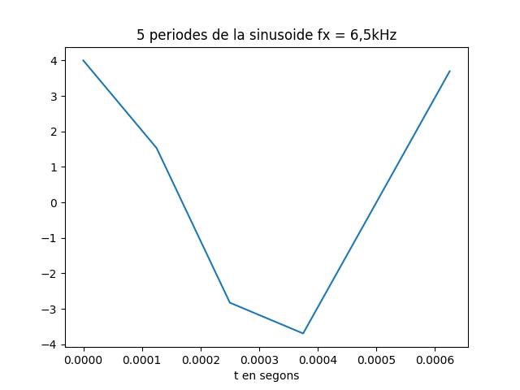
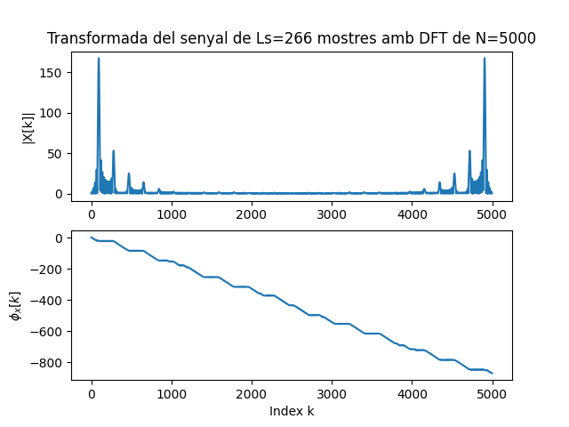

Primera tasca APA 2023: Anàlisi fitxer de so
============================================

## Nom i cognoms: Joan Marc Fuentes Soler 


## Representació temporal i freqüencial de senyals d'àudio.

Proves i exercicis a fer i entregar
-----------------------------------

### 1. Reprodueix l'exemple fent servir diferents freqüències per la sinusoide. Al menys considera $f_x = 4$ kHz, a banda d'una freqüència pròpia en el marge audible. Comenta els resultats.
```python
  T= 2.5                               # Durada de T segons
  fm=8000                              # Freqüència de mostratge en Hz
  A=4                                  # Amplitud de la sinusoide
  PI=np.pi                             # Valor del número pi
  L = int(fm*T)                      # Nombre de mostres del senyal digital
  Tm=1/fm                              # Període de mostratge
  t=Tm*np.arange(L)                    # Vector amb els valors de la variable temporal, de 0 a T

  # Freqüència 1 fx = 150 Hz 
  fx=150                               # Freqüència de la sinusoide 
   x = A * np.cos(2 * PI * fx * t)      # Senyal sinusoidal
  sf.write('so_exemple1.wav', x, fm)   # Escriptura del senyal a un fitxer en format wav

  Tx=1/fx                              # Període del senyal
  Ls=int(fm*5*Tx)                      # Nombre de mostres corresponents a 5 períodes de la sinusoide

  plt.figure(0)                                        # Nova figura
  plt.plot(t[0:Ls], x[0:Ls])                           # Representació del senyal en funció del temps
  plt.xlabel('t en segons')                            # Etiqueta eix temporal
  plt.title('5 periodes de la sinusoide fx = 150Hz')   # Títol del gràfic
  plt.show() 
  sd.play(x,fm)            # Reproducció d'àudio

  N=5000                   # Dimensió de la transformada discreta
  X=fft(x[0:Ls],N)         # Càlcul de la transformada de 5 períodes de la sinusoide
  k=np.arange(N)           # Vector amb els valors 0≤  k<N

  plt.figure(1)                         # Nova figura
  plt.subplot(211)                      # Espai per representar el mòdul
  plt.plot(k,abs(X))                    # Representació del mòdul de la transformada
  plt.title(f'Transformada del senyal de Ls={Ls} mostres amb DFT de N={N}')   # Etiqueta del títol
  plt.ylabel('|X[k]|')                  # Etiqueta de mòdul
  plt.subplot(212)                      # Espai per representar la fase
  plt.plot(k,np.unwrap(np.angle(X)))    # Representació de la fase de la transformad, desenroscada
  plt.xlabel('Index k')                 # Etiqueta de l'eix d'abscisses 
  plt.ylabel('$\phi_x[k]$')             # Etiqueta de la fase en Latex
  plt.show()                            # Per mostrar els grafics

  # Freqüència 2 fx1 = 4kHz
  fx1=4000                              # Freqüència de la sinusoide
  x1 = A * np.cos(2 * PI * fx1 * t)     # Senyal sinusoidal
  sf.write('so_exemple2.wav', x1, fm)   # Escriptura del senyal a un fitxer en format wav

  Tx1=1/fx1                             # Període del senyal
  Ls1=int(fm*5*Tx1)                     # Nombre de mostres corresponents a 5 períodes de la sinusoide

  plt.figure(0)                                      # Nova figura
  plt.plot(t[0:Ls1], x1[0:Ls1])                      # Representació del senyal en funció del temps
  plt.xlabel('t en segons')                          # Etiqueta eix temporal
  plt.title('5 periodes de la sinusoide fx = 4kHz')  # Títol del gràfic
  plt.show()                                         # Per mostrar els grafics
  sd.play(x1,fm)                                     # Reproducció d'àudio

  N=5000                        # Dimensió de la transformada discreta
  X1=fft(x1[0:Ls1], N)          # Càlcul de la transformada de 5 períodes de la sinusoide
  k=np.arange(N)                # Vector amb els valors 0≤  k<N

  plt.figure(1)                         # Nova figura
  plt.subplot(211)                      # Espai per representar el mòdul
  plt.plot(k,abs(X1))                   # Representació del mòdul de la transformada
  plt.title(f'Transformada del senyal de Ls={Ls1} mostres amb DFT de N={N}')   # Etiqueta del títol
  plt.ylabel('|X[k]|')                  # Etiqueta de mòdul
  plt.subplot(212)                      # Espai per representar la fase
  plt.plot(k,np.unwrap(np.angle(X1)))   # Representació de la fase de la transformad, desenroscada
  plt.xlabel('Index k')                 # Etiqueta de l'eix d'abscisses 
  plt.ylabel('$\phi_x[k]$')             # Etiqueta de la fase en Latex
  plt.show()                            # Per mostrar els gràfics

  # Freqüència 3 fx2 = 6,5kHz
  fx2=6500                              # Freqüència de la sinusoide 
  x2 = A * np.cos(2 * PI * fx2 * t)     # Senyal sinusoidal
  sf.write('so_exemple3.wav', x2, fm)   # Escriptura del senyal a un fitxer en format wav

  Tx2=1/fx2                             # Període del senyal
  Ls2=int(fm*5*Tx2)                     # Nombre de mostres corresponents a 5 períodes de la sinusoide

  plt.figure(0)                                         # Nova figura
  plt.plot(t[0:Ls2], x2[0:Ls2])                         # Representació del senyal en funció del temps
  plt.xlabel('t en segons')                             # Etiqueta eix temporal
  plt.title('5 periodes de la sinusoide fx = 6,5kHz')   # Títol del gràfic
  plt.show()                                            # Per mostrar els grafics
  sd.play(x2, fm)                                       # Reproducció d'àudio

  N=5000                         # Dimensió de la transformada discreta
  X2=fft(x2[0:Ls2],N)            # Càlcul de la transformada de 5 períodes de la sinusoide
  k=np.arange(N)                 # Vector amb els valors 0≤  k<N

  plt.figure(1)                         # Nova figura
  plt.subplot(211)                      # Espai per representar el mòdul
  plt.plot(k,abs(X2))                   # Representació del mòdul de la transformada
  plt.title(f'Transformada del senyal de Ls={Ls2} mostres amb DFT de N={N}')   # Etiqueta del títol
  plt.ylabel('|X[k]|')                  # Etiqueta de mòdul
  plt.subplot(212)                      # Espai per representar la fase
  plt.plot(k,np.unwrap(np.angle(X2)))   # Representació de la fase de la transformad, desenroscada
  plt.xlabel('Index k')                 # Etiqueta de l'eix d'abscisses 
  plt.ylabel('$\phi_x[k]$')             # Etiqueta de la fase en Latex
  plt.show()                            # Per mostrar els grafics
```
   + Podem escoltar que a les freqüències inferiors a 4kHz, en el nostre cas ```fx = 150Hz``` podem escoltar que el so es més greu i en el cas ```fx2 = 6500Hz``` més agut. 
  
### 2. Modifica el programa per considerar com a senyal a analitzar el senyal del fitxer wav que has creat 
```python
  x_r , fm = sf.read('so_exemple1.wav')     # Escriptura del senyal a un fitxer en format wav
  T = (1/fm)*len(x_r)                       # Durada de T segons
  Tm = 1/fm                                 # Període de mostratge
  L = int(fm*T)                             # Nombre de mostres del senyal digital
  t = Tm*np.arange(L)                       # Vector amb els valors de la variable temporal, de 0 a T

  # Freqüència 1 fx = 150 Hz 
  fx = 150              
  Tx=1/fx                                   # Període del senyal
  Ls_R=int(fm*5*Tx)                         # Nombre de mostres corresponents a 5 períodes de la sinusoide

  plt.figure(0)                             # Nova figura
  plt.plot(t[0:Ls_R], x[0:Ls_R])            # Representació del senyal en funció del temps
  plt.xlabel('t en segons')                 # Etiqueta eix temporal
  plt.title('5 periodes de la sinusoide fx = 150 Hz')  # Títol del gràfic
  plt.show()                                # Visualització de l'objecte gràfic. 
  sd.play(x_r,fm)                           # Reproducció d'àudio

  N=5000                                # Dimensió de la transformada discreta
  X_R=fft(x_r[0:Ls_R],N)                # Càlcul de la transformada de 5 períodes de la sinusoide
  k=np.arange(N)                        # Vector amb els valors 0≤  k<N
  plt.figure(1)                         # Nova figura
  plt.subplot(211)                      # Espai per representar el mòdul
  plt.plot(k,abs(X_R))                  # Representació del mòdul de la transformada
  plt.title(f'Transformada del senyal de Ls={Ls_R} mostres amb DFT de N={N}')   # Etiqueta del títol
  plt.ylabel('|X[k]|')                  # Etiqueta de mòdul
  plt.subplot(212)                      # Espai per representar la fase
  plt.plot(k,np.unwrap(np.angle(X_R)))  # Representació de la fase de la transformad, desenroscada
  plt.xlabel('Index k')                 # Etiqueta de l'eix d'abscisses 
  plt.ylabel('$\phi_x[k]$')             # Etiqueta de la fase en Latex
  plt.show()                            # Per mostrar els gràfics 
```
- En el cas ```fx = 150Hz``` 
  
  
- La Transformda de Fourier (```dB```) 
  
  

```python
  x_r1 , fm = sf.read('so_exemple2.wav')     # Escriptura del senyal a un fitxer en format wav
  T = (1/fm)*len(x_r)                       # Durada de T segons
  Tm = 1/fm                                 # Període de mostratge
  L = int(fm*T)                             # Nombre de mostres del senyal digital
  t = Tm*np.arange(L)                       # Vector amb els valors de la variable temporal, de 0 a T

  # Freqüència 2 fx1 = 4000 Hz 
  fx1 = 4000              
  Tx1=1/fx1                                  # Període del senyal
  Ls_R1=int(fm*5*Tx)                         # Nombre de mostres corresponents a 5 períodes de la sinusoide

  plt.figure(0)                             # Nova figura
  plt.plot(t[0:Ls_R1], x_r1[0:Ls_R1])       # Representació del senyal en funció del temps
  plt.xlabel('t en segons')                 # Etiqueta eix temporal
  plt.title('5 periodes de la sinusoide fx = 4kHz')  # Títol del gràfic
  plt.show()                                # Visualització de l'objecte gràfic. 
  sd.play(x_r1,fm)                          # Reproducció d'àudio

  N=5000                                # Dimensió de la transformada discreta
  X_R1=fft(x_r1[0:Ls_R1],N)                # Càlcul de la transformada de 5 períodes de la sinusoide
  k=np.arange(N)                        # Vector amb els valors 0≤  k<N
  plt.figure(1)                         # Nova figura
  plt.subplot(211)                      # Espai per representar el mòdul
  plt.plot(k,abs(X_R1))                  # Representació del mòdul de la transformada
  plt.title(f'Transformada del senyal de Ls={Ls_R1} mostres amb DFT de N={N}')   # Etiqueta del títol
  plt.ylabel('|X[k]|')                  # Etiqueta de mòdul
  plt.subplot(212)                      # Espai per representar la fase
  plt.plot(k,np.unwrap(np.angle(X_R1)))  # Representació de la fase de la transformad, desenroscada
  plt.xlabel('Index k')                 # Etiqueta de l'eix d'abscisses 
  plt.ylabel('$\phi_x[k]$')             # Etiqueta de la fase en Latex
  plt.show()                            # Per mostrar els gràfics
```
- En el cas ```fx = 4kHz``` 
  
  

- La Transformda de Fourier (```dB```) 
  
  
```python
  x_r2 , fm = sf.read('so_exemple3.wav')     # Escriptura del senyal a un fitxer en format wav
  T = (1/fm)*len(x_r)                       # Durada de T segons
  Tm = 1/fm                                 # Període de mostratge
  L = int(fm*T)                             # Nombre de mostres del senyal digital
  t = Tm*np.arange(L)                       # Vector amb els valors de la variable temporal, de 0 a T

  Freqüència 3 fx2 = 6500 Hz 
  fx2 = 6500              
  Tx2=1/fx2                                   # Període del senyal
  Ls_R2=int(fm*5*Tx)                         # Nombre de mostres corresponents a 5 períodes de la sinusoide

  plt.figure(0)                             # Nova figura
  plt.plot(t[0:Ls_R2], x_r2[0:Ls_R])            # Representació del senyal en funció del temps
  plt.xlabel('t en segons')                 # Etiqueta eix temporal
  plt.title('5 periodes de la sinusoide fx = 6,5kHz')  # Títol del gràfic
  plt.show()                                # Visualització de l'objecte gràfic. 
  sd.play(x_r2,fm)                           # Reproducció d'àudio

  N=5000                                # Dimensió de la transformada discreta
  X_R2=fft(x_r2[0:Ls_R2],N)                # Càlcul de la transformada de 5 períodes de la sinusoide
  k=np.arange(N)                        # Vector amb els valors 0≤  k<N
  plt.figure(1)                         # Nova figura
  plt.subplot(211)                      # Espai per representar el mòdul
  plt.plot(k,abs(X_R2))                  # Representació del mòdul de la transformada
  plt.title(f'Transformada del senyal de Ls={Ls_R2} mostres amb DFT de N={N}')   # Etiqueta del títol
  plt.ylabel('|X[k]|')                  # Etiqueta de mòdul
  plt.subplot(212)                      # Espai per representar la fase
  plt.plot(k,np.unwrap(np.angle(X_R2)))  # Representació de la fase de la transformad, desenroscada
  plt.xlabel('Index k')                 # Etiqueta de l'eix d'abscisses 
  plt.ylabel('$\phi_x[k]$')             # Etiqueta de la fase en Latex
  plt.show()                            # Per mostrar els gràfics
  ```
- En el cas ```fx = 6k5Hz``` 
  
  

- La Transformda de Fourier (```dB```) 
  
  

- Explica el resultat del apartat anterior.
    - Podem veure en les darreres grafiques que quan tenim una freqüència més baixa tenim mensy periodes i l'espectre de la TF esta més mostres i si tenim freqüències més altes es el contrari a les baixes freqüències.


### 3. Modifica el programa per representar el mòdul de la Transformada de Fourier en dB i l'eix d'abscisses en el marge de $0$ a $f_m/2$ en Hz.

- Comprova que la mesura de freqüència es correspon amb la freqüència de la sinusoide que has fet servir.
    ```python
    x_r , fm = sf.read('so_exemple1.wav')     # Escriptura del senyal a un fitxer en format wav
    T = (1/fm)*len(x_r)                       # Durada de T segons
    Tm = 1/fm                                 # Període de mostratge
    L = int(fm*T)                             # Nombre de mostres del senyal digital
    t = Tm*np.arange(L)                       # Vector amb els valors de la variable temporal, de 0 a T

    fx = 150                                  # Freqüència del senyal
    Tx=1/fx                                   # Període del senyal
    Ls_R=int(fm*5*Tx)                         # Nombre de mostres corresponents a 5 períodes de la sinusoide

    plt.figure(0)                             # Nova figura
    plt.plot(t[0:Ls_R], x_r[0:Ls_R])          # Representació del senyal en funció del temps
    plt.xlabel('t en segons')                 # Etiqueta eix temporal
    plt.title('5 periodes de la sinusoide fx = 150Hz')  # Títol del gràfic
    plt.show()                                # Visualització de l'objecte gràfic. 
    sd.play(x_r,fm)                           # Reproducció d'àudio

    N=5000                         # Dimensió de la transformada discreta
    X_R=fft(x_r[0:Ls_R],N)         # Càlcul de la transformada de 5 períodes de la sinusoide
    k=np.arange(N)                 # Vector amb els valors 0≤k<N

    fk=(k/N)*fm
    XdB= 20*np.log10((abs(X_R))/(max(abs(X_R))))
    plt.figure(1)                         # Nova figura
    plt.subplot(211)                      # Espai per representar el mòdul
    plt.plot(fk/2,XdB)                    # Representació del mòdul de la transformada
    plt.title(f'Transformada del senyal de Ls={Ls_R} mostres amb DFT de N={N}')   # Etiqueta del títol
    plt.ylabel('dB')                      # Etiqueta de mòdul
    plt.subplot(212)                      # Espai per representar la fase
    plt.plot(k,np.unwrap(np.angle(X_R)))  # Representació de la fase de la transformad, desenroscada
    plt.xlabel('Index k')                 # Etiqueta de l'eix d'abscisses 
    plt.ylabel('$\phi_x[k]$')             # Etiqueta de la fase en Latex
    plt.show()                            # Per mostrar els grafics
    ```

- Com pots identificar l'amplitud de la sinusoide a partir de la representació de la transformada? Comprova-ho amb el senyal generat.

- La Transformda de Fourier (```dB```) 
  
  

  - Es pot deduir per el número de les mostres del senyal ```Ls``` quan més mostres tindren més amplitud i si tenim menys mostres la amplitud serà més petita.


### 4. Tria un fitxer d'àudio en format wav i mono (el pots aconseguir si en tens amb altres formats amb el programa Audacity). 
- Llegeix el fitxer d'àudio i comprova:
```python
  obj = readwave.open('luzbel44.wav','r')                   # Obrim el fitxer
  print( "Nombre de canals:",obj.getnchannels())            # Nombre de canals
  if(obj.getnchannels()==1): {print("Mono")}               
  else: {print("Stereo")}
  print ( "Freqüència de mostratge:",obj.getframerate())    # Freqüència de mostratge.
  print ("Nombre de mostres de senyal: ",obj.getnframes())  # Nombre de mostres de senyal.
  obj.close()                                               # Sortim del fitxer
  ```
- Tria un segment de senyal de 25ms i insereix una gráfica amb la seva evolució temporal.   
```python
  T1= 25e-3                             # Durada de T segons
  x3,fm1 = sf.read('luzbel44.wav')      # Lectura del fitxer
  L1 = int(fm1*T1)                      # Nombre de mostres del senyal digital
  Tm1=1/fm1                             # Període de mostratge
  t1=np.arange(L1)                      # Vector amb els valors de la variable temporal, de 0 a T
  sf.write('luzbel44.wav',x3, fm1)

  plt.figure(0)                                                        # Nova figura
  plt.plot(x3[0:L1],t1[0:L1])                                          # Representació del senyal en funció del temps
  plt.xlabel('t en segons')                                            # Etiqueta eix temporal
  plt.title(f'Fragment audio: "luzbel44.wav" Durada:{T1} segons')      # Títol del gràfic
  plt.show()                                                           # Mostrar el grafic
```
- En el cas ```Audio luzbel44.wav``` 
  
  
  
- Representa la seva transformada en dB en funció de la freqüència, en el marge $f_m\le f\le f_m/2$.
  ```python
  N=5000                                      # Dimensió de la transformada discreta
  X3=fft(x3[0:L1],N)                          # Càlcul de la transformada de 5 períodes de la sinusoide
  k=np.arange(N)                              # Vector amb els valors 0≤k<N
  fk1=(k/N)*fm1
  X3dB= 20*np.log10((abs(X3))/(max(abs(X3))))
  plt.figure(1)                               # Nova figura
  plt.subplot(211)                            # Espai per representar els dB
  plt.plot(fk1,X3dB)                          # Representació dels dB en funció de les mostres 
  plt.title(f'Transformada del senyal de Ls={L1} mostres amb DFT de N={N}')   # Etiqueta del títol
  plt.ylabel('dB')                            # Etiqueta de mòdul
  plt.subplot(212)                            # Espai per representar la fase
  plt.plot(k,np.unwrap(np.angle(X3)))         # Representació de la fase de la transformad, desenroscada
  plt.xlabel('Index k')                       # Etiqueta de l'eix d'abscisses 
  plt.ylabel('$\phi_x[k]$')                   # Etiqueta de l'eix de coordenades
  plt.show()                                  # Per mostrar els gràfics
  ```
  - La Transformda de Fourier (```dB```) 
  
  
  
  - ...
- Quines son les freqüències més importants del segment triat?   
  - ....
