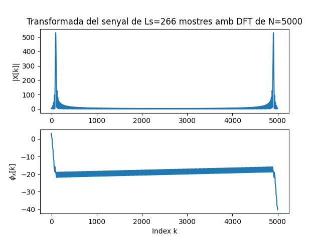

Primera tasca APA 2023: Anàlisi fitxer de so
============================================

## Nom i cognoms: Joan Marc Fuentes Soler 


## Representació temporal i freqüencial de senyals d'àudio.

### Domini temporal

Per llegir, escriure i representar un fitxer en format `*.wav` en python podem fem servir els següents mòduls:

- Numpy:
```python
import numpy as np
```
- Matplotlib: 
```python
import matplotlib.pyplot as plt
```
- Soundfile:
```python
import soundfile as sf
```

Per **crear** i **guardar** a un fitxer un senyal sinusoidal de freqüència `fx Hz`, digitalitzat a `fm Hz`, de durada `T` segons i amplitud 
`A` fem:

```python
T= 2.5                               # Durada de T segons
fm=8000                              # Freqüència de mostratge en Hz
fx=440                               # Freqüència de la sinusoide
A=4                                  # Amplitud de la sinusoide
pi=np.pi                             # Valor del número pi
L = int(fm * T)                      # Nombre de mostres del senyal digital
Tm=1/fm                              # Període de mostratge
t=Tm*np.arange(L)                    # Vector amb els valors de la variable temporal, de 0 a T
x = A * np.cos(2 * pi * fx * t)      # Senyal sinusoidal
sf.write('so_exemple1.wav', x, fm)   # Escriptura del senyal a un fitxer en format wav
```

El resultat és un fitxer guardat al directori de treball i que es pot reproduir amb qualsevol reproductor d'àudio

Per **representar** gràficament 5 períodes de senyal fem:

```python
Tx=1/fx                                   # Període del senyal
Ls=int(fm*5*Tx)                           # Nombre de mostres corresponents a 5 períodes de la sinusoide

plt.figure(0)                             # Nova figura
plt.plot(t[0:Ls], x[0:Ls])                # Representació del senyal en funció del temps
plt.xlabel('t en segons')                 # Etiqueta eix temporal
plt.title('5 periodes de la sinusoide')   # Títol del gràfic
plt.show()                                # Visualització de l'objecte gràfic. 
```

El resultat del gràfic és:


> Nota: Si es treballa amb ipython, es pot escriure %matplotlib i no cal posar el plt.show() per veure gràfics

El senyal es pot **escoltar (reproduir)** directament des de python important un entorn de treball amb els dispositius de so, com per 
exemple `sounddevice`:

```python
import sounddevice as sd      # Importem el mòdul sounddevice per accedir a la tarja de so
sd.play(x, fm)                # Reproducció d'àudio
```

### Domini transformat

Domini transformat. Els senyals es poden analitzar en freqüència fent servir la Transformada Discreta de Fourier. 

La funció que incorpora el paquet `numpy` al submòdul `fft` és `fft`:

```python
from numpy.fft import fft     # Importem la funció fft
N=5000                        # Dimensió de la transformada discreta
X=fft(x[0 : Ls], N)           # Càlcul de la transformada de 5 períodes de la sinusoide
```

I podem representar el mòdul i la fase, en funció de la posició de cada valor amb:

```python
k=np.arange(N)                        # Vector amb els valors 0≤  k<N

plt.figure(1)                         # Nova figura
plt.subplot(211)                      # Espai per representar el mòdul
plt.plot(k,abs(X))                    # Representació del mòdul de la transformada
plt.title(f'Transformada del senyal de Ls={Ls} mostres amb DFT de N={N}')   # Etiqueta del títol
plt.ylabel('|X[k]|')                  # Etiqueta de mòdul
plt.subplot(212)                      # Espai per representar la fase
plt.plot(k,np.unwrap(np.angle(X)))    # Representació de la fase de la transformad, desenroscada
plt.xlabel('Index k')                 # Etiqueta de l'eix d'abscisses 
plt.ylabel('$\phi_x[k]$')             # Etiqueta de la fase en Latex
plt.show()                            # Per mostrar els grafics
```


Proves i exercicis a fer i entregar
-----------------------------------

1. Reprodueix l'exemple fent servir diferents freqüències per la sinusoide. Al menys considera $f_x = 4$ kHz, a banda d'una freqüència pròpia en el marge audible. Comenta els resultats.
``` python    
T= 2.5                               # Durada de T segons
fm=8000                              # Freqüència de mostratge en Hz
A=4                                  # Amplitud de la sinusoide
PI=np.pi                             # Valor del número pi
L = int(fm * T)                      # Nombre de mostres del senyal digital
Tm=1/fm                              # Període de mostratge
t=Tm*np.arange(L)                    # Vector amb els valors de la variable temporal, de 0 a T

# Freqüència 1 fx = 150 Hz 
fx=150                               # Freqüència de la sinusoide 
x = A * np.cos(2 * PI * fx * t)      # Senyal sinusoidal
sf.write('so_exemple1.wav', x, fm)   # Escriptura del senyal a un fitxer en format wav

Tx=1/fx                              # Període del senyal
Ls=int((fm/2)*5*Tx)                  # Nombre de mostres corresponents a 5 períodes de la sinusoide

plt.figure(0)                             # Nova figura
plt.plot(t[0:Ls], x[0:Ls])                # Representació del senyal en funció del temps
plt.xlabel('t en segons')                 # Etiqueta eix temporal
plt.title('5 periodes de la sinusoide fx = 150Hz')   # Títol del gràfic
plt.show() 

sd.play(x,fm)            # Reproducció d'àudio

N=5000                   # Dimensió de la transformada discreta
X=fft(x[0:Ls],N)         # Càlcul de la transformada de 5 períodes de la sinusoide

k=np.arange(N)           # Vector amb els valors 0≤  k<N

k=np.arange(N)                        # Vector amb els valors 0≤  k<N

plt.figure(1)                         # Nova figura
plt.subplot(211)                      # Espai per representar el mòdul
plt.plot(k,abs(X))                    # Representació del mòdul de la transformada
plt.title(f'Transformada del senyal de Ls={Ls} mostres amb DFT de N={N}')   # Etiqueta del títol
plt.ylabel('|X[k]|')                  # Etiqueta de mòdul
plt.subplot(212)                      # Espai per representar la fase
plt.plot(k,np.unwrap(np.angle(X)))    # Representació de la fase de la transformad, desenroscada
plt.xlabel('Index k')                 # Etiqueta de l'eix d'abscisses 
plt.ylabel('$\phi_x[k]$')             # Etiqueta de la fase en Latex
plt.show()                            # Per mostrar els grafics

# Freqüència 2 fx1 = 4kHz
fx1=4000                              # Freqüència de la sinusoide
x1 = A * np.cos(2 * PI * fx1 * t)     # Senyal sinusoidal
sf.write('so_exemple2.wav', x1, fm)   # Escriptura del senyal a un fitxer en format wav

Tx1=1/fx1                                 # Període del senyal
Ls1=int((fm/2)*5*Tx1)                     # Nombre de mostres corresponents a 5 períodes de la sinusoide

plt.figure(0)                             # Nova figura
plt.plot(t[0:Ls1], x1[0:Ls1])             # Representació del senyal en funció del temps
plt.xlabel('t en segons')                 # Etiqueta eix temporal
plt.title('5 periodes de la sinusoide fx = 4kHz')   # Títol del gràfic
plt.show()

sd.play(x1, fm)               # Reproducció d'àudio

N=5000                        # Dimensió de la transformada discreta
X1=fft(x1[0 : Ls1], N)        # Càlcul de la transformada de 5 períodes de la sinusoide

k=np.arange(N)                # Vector amb els valors 0≤  k<N

plt.figure(1)                         # Nova figura
plt.subplot(211)                      # Espai per representar el mòdul
plt.plot(k,abs(X1))                    # Representació del mòdul de la transformada
plt.title(f'Transformada del senyal de Ls={Ls1} mostres amb DFT de N={N}')   # Etiqueta del títol
plt.ylabel('|X[k]|')                  # Etiqueta de mòdul
plt.subplot(212)                      # Espai per representar la fase
plt.plot(k,np.unwrap(np.angle(X1)))    # Representació de la fase de la transformad, desenroscada
plt.xlabel('Index k')                 # Etiqueta de l'eix d'abscisses 
plt.ylabel('$\phi_x[k]$')             # Etiqueta de la fase en Latex
plt.show()                            # Per mostrar els grafics

# Freqüència 3 fx2 = 6,5kHz
fx2=6500                              # Freqüència de la sinusoide 
x2 = A * np.cos(2 * PI * fx2 * t)     # Senyal sinusoidal
sf.write('so_exemple3.wav', x2, fm)   # Escriptura del senyal a un fitxer en format wav

Tx2=1/fx2                             # Període del senyal
Ls2=int((fm/2)*5*Tx2)                 # Nombre de mostres corresponents a 5 períodes de la sinusoide

plt.figure(0)                            # Nova figura
plt.plot(t[0:Ls2], x2[0:Ls2])            # Representació del senyal en funció del temps
plt.xlabel('t en segons')                # Etiqueta eix temporal
plt.title('5 periodes de la sinusoide fx = 6,5kHz')   # Títol del gràfic
plt.show() 

sd.play(x2, fm)            # Reproducció d'àudio

N=5000                     # Dimensió de la transformada discreta
X2=fft(x2[0:Ls2], N)       # Càlcul de la transformada de 5 períodes de la sinusoide

k=np.arange(N)             # Vector amb els valors 0≤  k<N

plt.figure(1)                         # Nova figura
plt.subplot(211)                      # Espai per representar el mòdul
plt.plot(k,abs(X2))                    # Representació del mòdul de la transformada
plt.title(f'Transformada del senyal de Ls={Ls2} mostres amb DFT de N={N}')   # Etiqueta del títol
plt.ylabel('|X[k]|')                  # Etiqueta de mòdul
plt.subplot(212)                      # Espai per representar la fase
plt.plot(k,np.unwrap(np.angle(X2)))    # Representació de la fase de la transformad, desenroscada
plt.xlabel('Index k')                 # Etiqueta de l'eix d'abscisses 
plt.ylabel('$\phi_x[k]$')             # Etiqueta de la fase en Latex
plt.show()                            # Per mostrar els grafics
```
### Explicació Pregunta 1 :
+ Podem escoltar que a les freqüències inferiors a 4kHz, en el nostre cas ```fx = 150Hz``` podem escoltar que el so es més greu i en el cas ```fx2 = 6500Hz``` més agut. 
+   
2. Modifica el programa per considerar com a senyal a analitzar el senyal del fitxer wav que has creat 
    (`x_r, fm = sf.read('nom_fitxer.wav')`).

    - Insereix a continuació una gràfica que mostri 5 períodes del senyal i la seva transformada.
    - En el cas ```fx = 150Hz``` 
  
   - La Transformda de Fourier (```dB```) 
  

    - En el cas ```fx1 = 4000Hz``` 
  
   - La Transformda de Fourier (```dB```) 
  


    - En el cas ```fx2 = 6500Hz``` 
  
   - La Transformda de Fourier (```dB```) 
  
    - Explica el resultat del apartat anterior.
      - Podem veure en les darreres grafiques que quan tenim una freqüència més baixa tenim mensy periodes i l'espectre de la TF esta més mostres i si tenim freqüències més altes es el contrari a les baixes freqüències.


3. Modifica el programa per representar el mòdul de la Transformada de Fourier en dB i l'eix d'abscisses en el marge de
    $0$ a $f_m/2$ en Hz.

    - Comprova que la mesura de freqüència es correspon amb la freqüència de la sinusoide que has fet servir.
        ```python
        plt.figure(1)                         # Nova figura
        plt.subplot(211)                      # Espai per representar el mòdul
        plt.plot(k,20*np.log10((abs(X))/(max(abs(X))))) # Representació del mòdul de la transformada
        plt.title(f'Transformada del senyal de Ls={Ls} mostres amb DFT de N={N}')   # Etiqueta del títol
        plt.ylabel('dB')                      # Etiqueta de mòdul
        plt.subplot(212)                      # Espai per representar la fase
        plt.plot(k,(k/N)*fm)                  # Representació de la relació de l'index k i la freqüència en Hz
        plt.xlabel('Index k')                 # Etiqueta de l'eix d'abscisses 
        plt.ylabel('k-Hz')                    # Etiqueta de la k
        plt.show()                            # Per mostrar els grafics
        ```
   - Com pots identificar l'amplitud de la sinusoide a partir de la representació de la transformada? Comprova-ho amb el senyal generat.

        - La Transformda de Fourier (```dB```) 
  
        - La Transformda de Fourier (```dB```) 
  
        - La Transformda de Fourier (```dB```) 
  

Es pot deduir per el número de les mostres del senyal ```Ls``` quan més mostres tindren més amplitud i si tenim menys mostres la amplitud serà més petita.


4. Tria un fitxer d'àudio en format wav i mono (el pots aconseguir si en tens amb altres formats amb el programa Audacity). 
    Llegeix el fitxer d'àudio i comprova:
    ```python
    obj = readwave.open('luzbel44.wav','r')
    ```
    - Nombre de canals 
    ```python
    print( "Nombre de canals",obj.getnchannels())
    ```
    - Freqüència de mostratge.`
    ```python
    print ( "Freqüència de mostratge:",obj.getframerate())
    ```
    - Nombre de mostres de senyal.
    ```python
    print ("Nombre de mostres de senyal.",obj.getnframes())
    obj.close()
    ```
    - Tria un segment de senyal de 25ms i insereix una gráfica amb la seva evolució temporal.   
    ```python
    ```
    - Representa la seva transformada en dB en funció de la freqüència, en el marge $f_m\le f\le f_m/2$.
    ```python
    ```
    - Quines son les freqüències més importants del segment triat?   
    ```python
    ```


Entrega
-------

- L'alumne ha de respondre a totes les qüestions formulades en aquest mateix fitxer, README.md.
    - El format del fitxer es l'anomenat *Markdown* que permet generar textos amb capacitats gràfiques (com ara *cursiva*, **negreta**,
      fòrmules matemàtiques, taules, etc.), sense perdre la llegibilitat en mode text.
    - Disposa d'una petita introducció a llenguatge de Markdown al fitxer `MARKDOWN.md`.
- El repositori GitHub ha d'incloure un fitxer amb tot el codi necesari per respondre les qüestions i dibuixar les gràfiques.
- El nom del fitxer o fitxers amb el codi ha de començar amb les inicials de l'alumne (per exemple, `fvp_codi.py`).
- Recordéu ficar el el vostre nom complet a l'inici del fitxer o fitxers amb el codi i d'emplar el camp `Nom i cognoms` a dalt de tot
  d'aquest fitxer, README.md.
